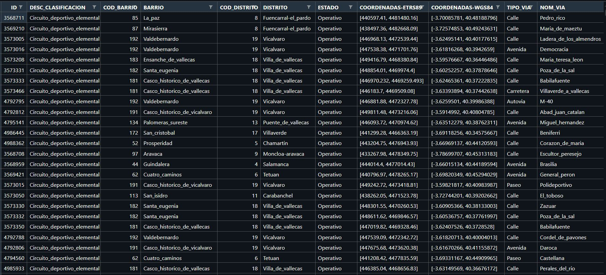
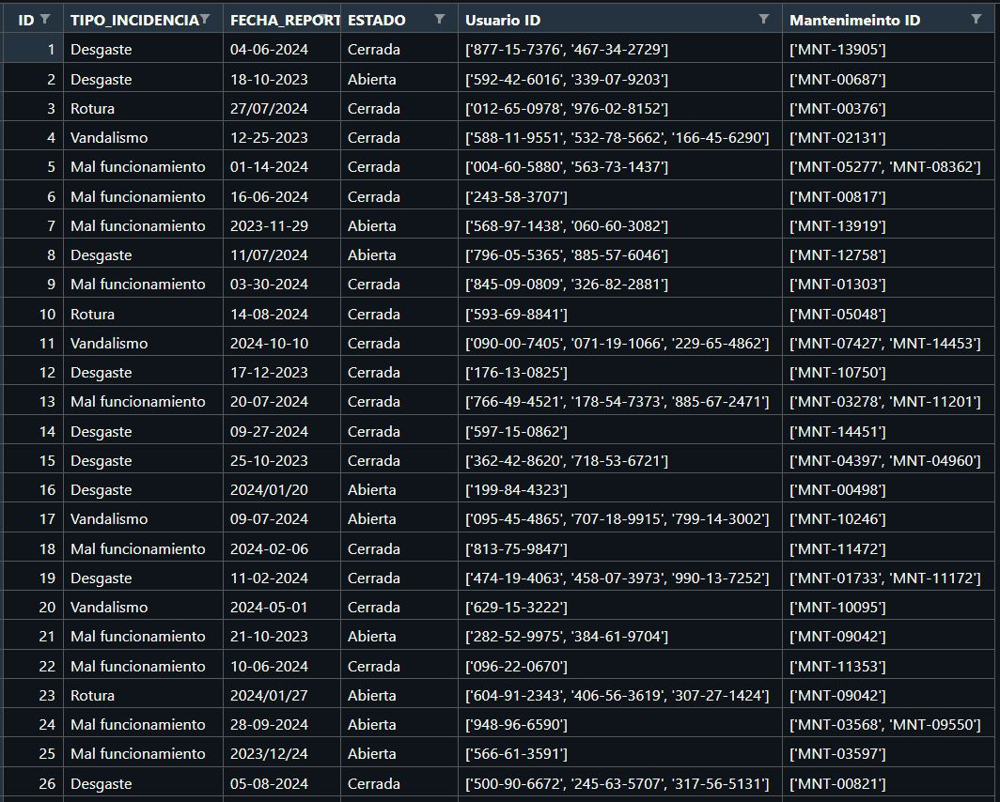
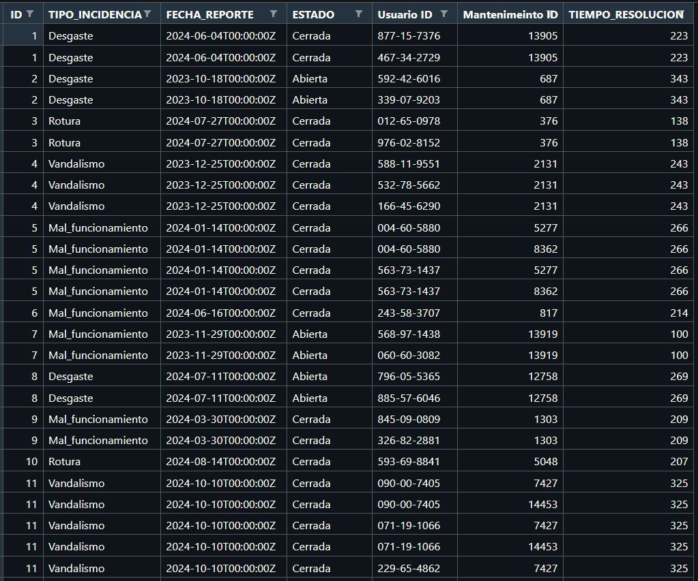
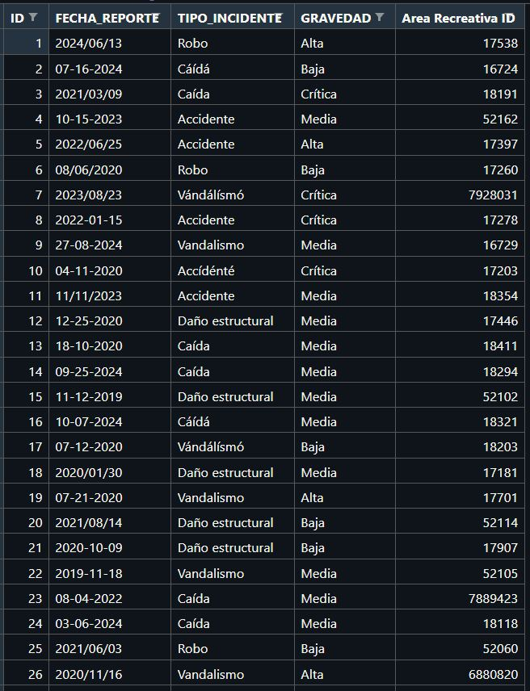
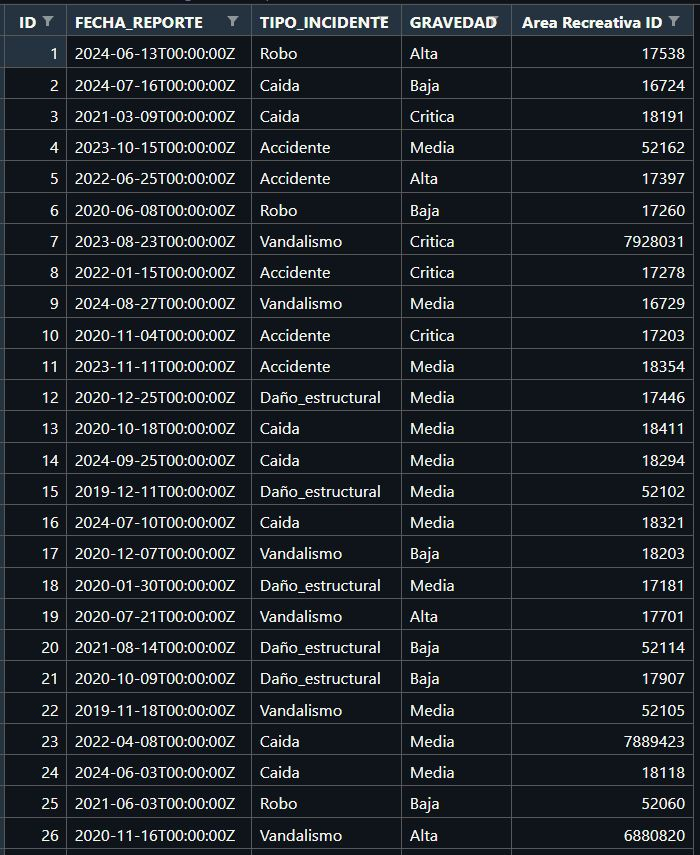
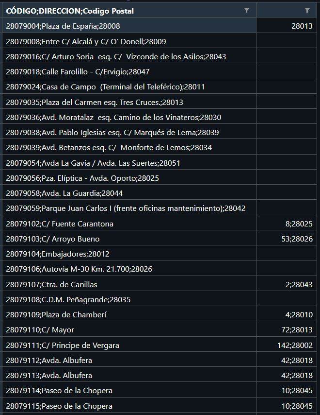
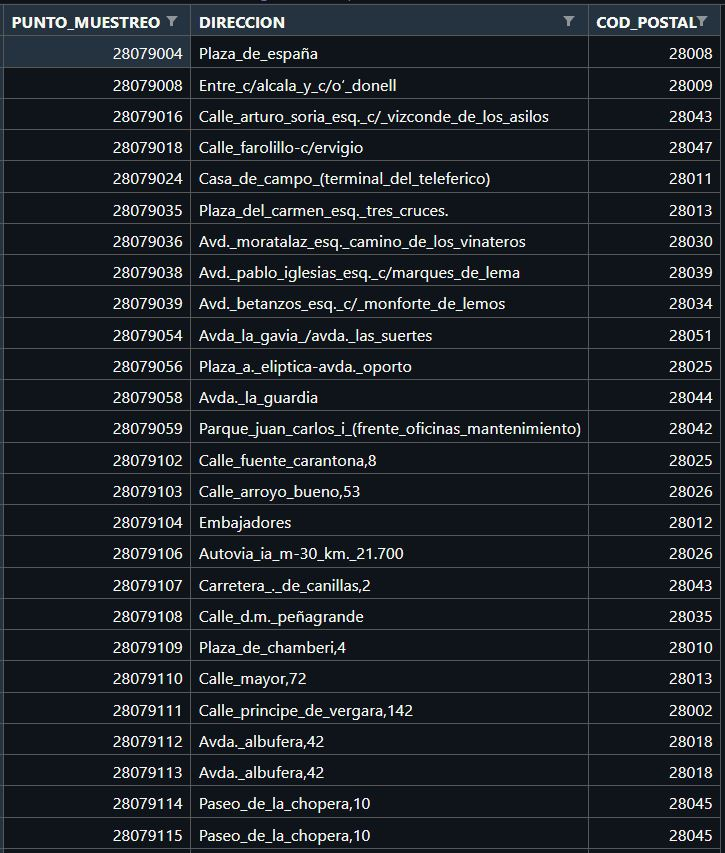

<h1 align="center">Preprocesado de varios datasets ✨ </h1>

  <h2 align="left"> ● Antes del preprocesado: </h2>
  
  <h2 align="left"> ● Después del preprocesado: </h2>
  
  

  <h2 align="left"> ● Antes del preprocesado: </h2>
  
  <h2 align="left"> ● Después del preprocesado: </h2>
  
  

  <h2 align="left"> ● Antes del preprocesado: </h2>
  
  <h2 align="left"> ● Después del preprocesado: </h2>
  
  

  <h2 align="left"> ● Antes del preprocesado: </h2>
  
  <h2 align="left"> ● Después del preprocesado: </h2>
  
  

