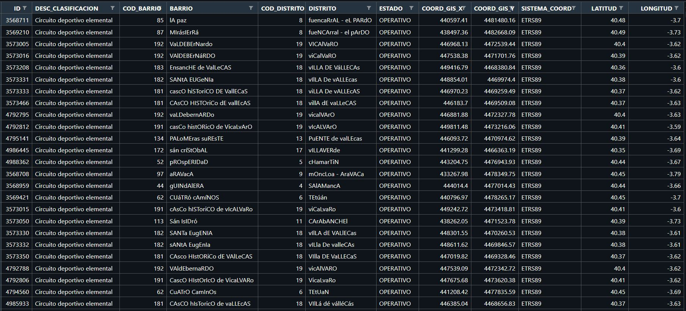

<h1 align="center">Preprocesado de varios datasets 🤖 </h1>

  <h2 align="left"> ● AreasSucio.csv </h2>
  
  <h2 align="left"> ● AreasLimpio.csv </h2>
  
  

  <h2 align="left"> ● IncidenciasUsuariosSucio.csv </h2>
  
  <h2 align="left"> ● IncidenciasUsuariosLimpio.csv </h2>
  
  

  <h2 align="left"> ● IncidentesSeguridadSucio.csv </h2>
  
  <h2 align="left"> ● IncidentesSeguridadLimpio.csv </h2>
  
  <h2 align="left"> ● estaciones_meteo_CodigoPostal.csv </h2>
  
  <h2 align="left"> ● estaciones_meteo_CodigoPostalLimpio.csv </h2>
  

